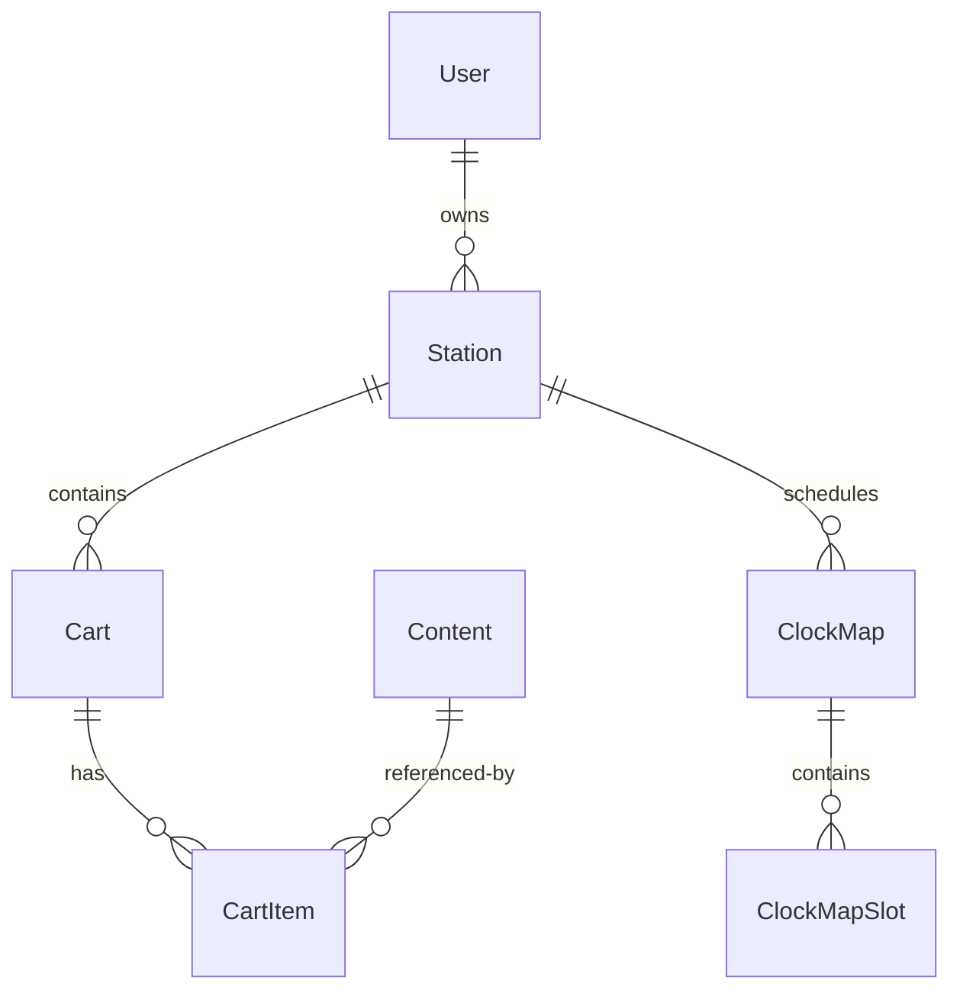

# B2B Radio Station Playlist Generator

## Purpose
This system provides customized in-store music and advertising solutions for retail businesses by generating M3U playlists that can be uploaded to separate streaming servers. It serves as a B2B platform where businesses can create their own internet radio stations with customized content delivery.

## Core Features & Functionality

### Content Library System
- **Vertical-Specific Libraries**
  - Shared music and advertising content per business category
  - Example: Pet stores share different content than hardware stores
- **Station-Specific Libraries**
  - Custom announcements and local content
  - Personal content library for each station
- **Global Libraries**
  - System-wide content available across all verticals
  - Managed by admin users
- **Force Cart System (FRC1)**
  - Admin-only cart management
  - Allows system-wide content insertion
  - Invisible to end users

### Music Selection & Rotation
- **Format Selection**
  - ~20 predefined music styles (genres and mixed categories)
  - User-defined percentage splits between formats
  - Round-robin selection between chosen formats
- **Smart Content Selection**
  - Optional tag-based scoring system (can be enabled/disabled per user)
  - Last-played tracking to prevent repetition
  - Artist separation rules
- **Content Scheduling**
  - Start/end dates for all content
  - Day-of-week restrictions
  - Hour-based restrictions

## Scope & Architecture Overview
The system is designed as a content management and playlist generation platform with clear boundaries:

### Core Responsibilities
- Content library management
- Playlist scheduling and generation
- M3U file creation
- User and station management
- Template-based content scheduling
- Tag-based content scoring and selection

### Out of Scope
- Audio streaming (handled by separate streaming servers)
- Audio file hosting (references external file paths)
- Real-time playback controls
- Stream monitoring

### Key Design Decisions
- Clock templates represent roughly one hour of content
- Content insertion uses a cart system similar to traditional radio
- Force carts (FRC1) allow admin-only content insertion
- Tag-based scoring system for music selection can be enabled/disabled per user
- Playlist generator runs on cron for 24h playlists with on-demand regeneration
- Audio requirements: 64kbps/16bit/mono/441khz, normalized to -6db

### User Hierarchy
1. Admin Users
   - Full system access
   - Can create and manage force carts
   - System-wide content management
2. Chain Users
   - Multi-station management
   - Content management across locations
3. Store Users
   - Single station management
   - Local content customization
   - Music style selection

### Scheduling System

#### Clock Templates
- Represents approximately one hour of content
- Built using a drag-and-drop editor
- Each slot in the template defines:
  - Content type (song, cart, jingle)
  - Minute offset for timing
  - Cart assignments for advertising slots
- Currently uses hour-based slots with plans for:
  - Future minute-by-minute scheduling
  - Automatic content insertion based on song length
  - Mid-song ad prevention
  
#### Clock Maps (Dayparting)
- Weekly scheduling system
- Assigns clock templates to specific:
  - Days of the week
  - Hours of the day
- Allows different programming for:
  - Different times of day
  - Different days of the week
  - Special events or promotions
- Templates can be reused across multiple time slots

#### Content Rotation
- Uses cart system for content organization
- Standard carts visible to all users
- Force carts (FRC1) for admin-only content
- Cart content can be scheduled with:
  - Start/end dates
  - Day-of-week restrictions
  - Hour restrictions
- Rotation index tracks content usage to prevent repetition

### Content Management
- Users can select from ~20 music styles (genres and mixed categories)
- Playlists are generated based on:
  - Selected music formats
  - Tag scores (if enabled)
  - Last played history
  - Scheduling rules
- Custom audio uploads require admin approval unless automated encoding is implemented
- Content can be mass-assigned across multiple stations

## Technical Stack Overview (as of 2025)
```tech-stack
Frontend: React 19 (2024 release), React Router v7
Backend: Node.js, Express
Database: Sequelize ORM (SQLite/MySQL/PostgreSQL)
Key Libraries: @dnd-kit/core, @dnd-kit/sortable, @dnd-kit/utilities, Axios
```

## Project Architecture

### Database Models
```models
User
├── roles: ['admin', 'chain', 'store']
├── parentUserId: hierarchical relationship
└── stations: one-to-many

Station
├── verticalId: business category
├── userId: owner reference
├── clockMapId: scheduling reference
└── defaultClockTemplateId: template reference

Content
├── contentType: ['song', 'ad', 'jingle']
├── libraryId: content organization
├── duration: length in seconds
└── score: ranking value

Cart
├── stationId: owner reference
├── category: content grouping
└── rotationIndex: play tracking
└── items: CartItem[] relationship
```

### Key Components

#### Backend Services
```node
/routes/
├── api.js              # Main API router
├── admin/              # Admin-specific routes
├── auth.js             # Authentication handlers 
└── contentCrudRoutes.js # Content management

/models/
├── index.js            # Model relationships
├── User.js             # User model
└── Station.js          # Station model
```

#### Frontend Structure
```react
/src/
├── pages/
│   ├── ClockTemplateEditorDnd.jsx  # DnD template editor
│   ├── ContentLibraryList.jsx      # Content management
│   └── StationsList.jsx            # Station management
└── App.jsx                         # Main component
```

## Core Features

### Clock Template System
- Drag-and-drop template editor using @dnd-kit
- Slot types: song, cart, jingle
- Cart assignment with real-time updates
- Minute offset management
- Error handling for invalid states

### Content Management
```features
Libraries
├── Global shared
├── Vertical-specific
├── Station-specific
└── User custom

Content Types
├── Music tracks
├── Advertisements
├── Jingles
└── Station IDs
```

### Playlist Generation
1. Template-based hour structure
2. Content selection logic
3. Scheduling rules application
4. M3U file generation
5. FTP delivery

## Developer Setup

### Prerequisites
```bash
Node.js >= 16
npm >= 7
SQLite/MySQL/PostgreSQL
```

### Installation
```bash
# Clone and setup backend
git clone [repository-url]
cd music-playlist-generator
npm install

# Setup frontend
cd music-playlist-admin-react19
npm install
npm install @dnd-kit/core @dnd-kit/sortable @dnd-kit/utilities

# Run development servers
# Backend (port 5000)
npm run dev

# Frontend (port 3000)
cd music-playlist-admin-react19
npm run dev
```

### Environment Configuration
```env
DB_NAME=your_database
DB_USER=your_username
DB_PASS=your_password
DB_HOST=localhost
JWT_SECRET=your_secret
```

## API Endpoints

### Core Routes
```api
POST   /api/auth/login           # Authentication
GET    /api/stations            # List stations
POST   /api/stations            # Create station
GET    /api/content             # List content
POST   /api/content             # Create content
GET    /api/clock-templates     # List templates
POST   /api/clock-templates     # Create template
```

### Feature Routes
```api
POST   /api/on-demand           # Generate playlist
GET    /api/reports             # Analytics
POST   /api/tags                # Content tagging
```

## Database Relationships


## Critical Infrastructure

### Testing Framework
```testing
TODO: Implement testing framework
- Unit tests for backend services
- Component testing for React frontend
- Integration tests for playlist generation
- Audio processing validation tests
```

### CI/CD Pipeline
```ci-cd
TODO: Implement CI/CD pipeline
- Automated testing
- Code quality checks
- Build verification
- Deployment automation
```

### Production Deployment
```deployment
TODO: Document production deployment
- Server requirements
- Load balancing considerations
- Database scaling
- Content delivery optimization
- Monitoring and logging
```

## Audio Processing
```requirements
Format: 64kbps/16bit/mono/44.1kHz
Normalization: -6dB
Output: M3U playlist
Delivery: FTP to streaming server
```

### Audio Requirements
```requirements
Format: 64kbps/16bit/mono/44.1kHz
Normalization: -6dB
Custom Upload Process:
- Admin approval required
- Supported formats: MP3, WAV
- Automated encoding (future feature)
```

### Content Distribution
- Mass assignment tools for:
  - Chain-wide content updates
  - Vertical-specific content distribution
  - Holiday programming
  - Advertising campaign deployment
- Content scheduling with:
  - Date ranges
  - Time restrictions
  - Vertical targeting

### Reporting & Analytics
- **User Behavior**
  - Format preferences
  - Popular content tracking
  - Feedback analysis (when enabled)
- **Content Performance**
  - Play frequency
  - Vertical-specific trends
  - Chain-wide patterns
- **Administrative**
  - Playlist logs
  - PRO reporting support
  - Content distribution metrics

<!-- 
This project follows a three-tier architecture:
1. Frontend React application for admin interface
2. Node.js/Express backend API
3. SQL database for data persistence

Key technical considerations include:
- JWT-based authentication
- Role-based access control
- Hierarchical data relationships
- Real-time drag-and-drop interactions
- Audio format standardization
-->