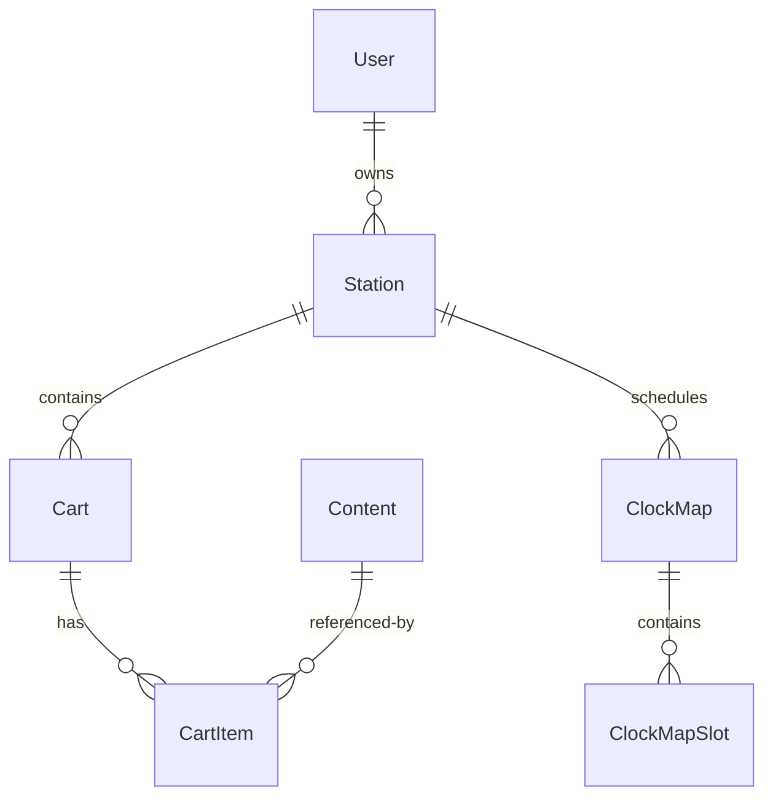

# B2B Radio Station Playlist Generator

## Purpose
This system provides customized in-store music and advertising solutions for retail businesses by generating M3U playlists that can be uploaded to separate streaming servers. It serves as a B2B platform where businesses can create their own internet radio stations with customized content delivery.

## Core Features & Functionality

### Content Library System
- **Vertical-Specific Libraries**
  - Two implemented types:
    - VERTICAL_MUSIC: Music specific to business verticals
    - VERTICAL_ADS: Advertising content for specific verticals
  - ✓ Implemented: Vertical-specific content restrictions
  - ✓ Implemented: Genre rules and restrictions
  - Planned: Enhanced vertical categorization
  
- **Station-Specific Libraries**
  - ✓ Implemented: STATION_CUSTOM type
  - ✓ Implemented: Personal content libraries tied to specific users
  - ✓ Implemented: Support for custom jingles
  - Planned: Enhanced local content management
  
- **Global Libraries**
  - ✓ Implemented: GLOBAL_MUSIC type
  - ✓ Implemented: System-wide content
  - ✓ Implemented: Admin-only management
  - ✓ Implemented: Genre restrictions
  
- **Force Cart System (FRC1)**
  - Admin-only cart management
  - Allows system-wide content insertion
  - Invisible to end users
 
- **Library Management**
  - ✓ Implemented: Content type restrictions
  - ✓ Implemented: Vertical-based restrictions
  - ✓ Implemented: Library compatibility validation
  - Planned: Enhanced mass content assignment

### Music Selection & Rotation
- **Format Selection**
  - ~20 predefined music styles (genres and mixed categories like "Classic Rock" or "80s Hits")
  - User-defined percentage splits between formats (e.g., 50% classic rock, 25% country, 25% jazz)
  - Round-robin format selection during playlist generation to maintain specified percentages
- **Smart Content Selection**
  - Optional tag-based scoring system (can be enabled/disabled per user)
  - Last-played tracking to prevent repetition
  - Artist separation rules
- **Content Scheduling**
  - Start/end dates for all content
  - Day-of-week restrictions
  - Hour-based restrictions

## Scope & Architecture Overview
The system is designed as a content management and playlist generation platform with clear boundaries:

### Core Responsibilities
- Content library management
- Playlist scheduling and generation
- M3U file creation
- User and station management
- Template-based content scheduling
- Tag-based content scoring and selection

### Out of Scope
- Audio streaming (handled by separate streaming servers)
- Audio file hosting (references external file paths)
- Real-time playback controls
- Stream monitoring

### Key Design Decisions
- Clock templates represent roughly one hour of content
- Content insertion uses a cart system similar to traditional radio
- Force carts (FRC1) allow admin-only content insertion
- Tag-based scoring system for music selection can be enabled/disabled per user
- Playlist generator runs on cron for 24h playlists with on-demand regeneration
- Audio requirements: 64kbps/16bit/mono/441khz, normalized to -6db

### User Hierarchy
1. Admin Users
   - Full system access
   - Can create and manage force carts
   - System-wide content management
2. Chain Users
   - Multi-station management
   - Content management across locations
3. Store Users
   - Single station management
   - Local content customization
   - Music style selection

### Scheduling System

#### Clock Templates
- Represents approximately one hour of content
- Built using a drag-and-drop editor (React with @dnd-kit)
- Each slot in the template defines:
  - Content type (song, cart, jingle)
  - Minute offset for timing
  - Cart assignments for advertising slots
- Current Implementation:
  - Hour-based scheduling using clock templates
  - Templates assigned to specific days/hours via Clock Maps
  - Cart slots skipped if no content available
- Future Enhancements:
  - Minute-by-minute scheduling post-playlist generation
  - Intelligent content insertion based on actual song lengths
  - Protection against mid-song advertising insertion
  - Smarter transition handling between content
  
#### Clock Maps (Dayparting)
- Weekly scheduling system
- Assigns clock templates to specific:
  - Days of the week
  - Hours of the day
- Allows different programming for:
  - Different times of day
  - Different days of the week
  - Special events or promotions
- Templates can be reused across multiple time slots

#### Content Rotation
- Admin Interface:
  - Cart system for content organization
  - Cart content scheduling with:
    - Start/end dates
    - Day-of-week restrictions
    - Hour restrictions
  - Force carts (FRC1) for admin-only content
  - Rotation index tracks content usage
- End User Interface:
  - Simplified ad library selection
  - Date/time scheduling for ads
  - Music style selection with percentage splits
  - No direct interaction with cart system

### Content Management & Distribution
#### Format Management
- Users select from ~20 predefined music styles:
  - Pure genres (Rock, Country, Jazz, etc.)
  - Mixed categories (80s Hits, Classic Rock, etc.)
  - Customizable percentage splits between formats
  
#### Playlist Generation Logic
- Content selection prioritizes:
  1. User's selected formats in specified percentages
  2. Tag scores (when feedback system enabled)
  3. Last played restrictions (prevent repetition)
  4. Scheduling rules and restrictions

#### Content Distribution Tools
- Mass assignment capabilities:
  - Chain-wide content distribution
  - Vertical-specific content updates
  - Holiday programming deployment
  - Multi-station advertising campaigns
- Standard and Force Cart management:
  - Regular carts visible to all users
  - Force carts (FRC1) for admin-only content
  - Same scheduling capabilities for both types
  - Empty carts skipped during playlist generation

## Technical Stack Overview (as of 2025)
```tech-stack
Frontend: React 19 (2024 release), React Router v7
Backend: Node.js, Express
Database: Sequelize ORM (SQLite/MySQL/PostgreSQL)
Key Libraries: @dnd-kit/core, @dnd-kit/sortable, @dnd-kit/utilities, Axios
```

## Project Architecture

### Database Models
```models
User
├── name: user name
├── email: email address
├── role: ['admin', 'chain', 'store']
├── parentUserId: hierarchical user relationship
├── preferences: user settings
└── stations: one-to-many relationship

Station
├── name: station name
├── userId: owner reference
├── vertical: business type
├── settings: station configuration
├── clockMapId: scheduling reference
└── defaultClockTemplateId: fallback template

Content
├── contentType: ['song', 'ad', 'jingle']
├── libraryId: content organization
├── duration: length in seconds
└── score: ranking value

Cart
├── stationId: owner reference
├── category: content grouping
├── rotationIndex: play tracking
└── items: CartItem[] relationship
```

### Planned Content Type Architecture
The system will transition to three specialized content models while maintaining existing models:

#### New Content Models
```models
MusicContent
├── artist: artist name
├── album: album name
├── releaseYear: year released
├── formats: array of music formats
├── bpm: tempo tracking
├── energyLevel: energy rating
├── tagScores: scoring data
└── playHistory: play tracking

AdvertisingContent
├── campaignId: campaign reference
├── clientName: client tracking
├── priority: play priority
├── playCount: required plays
├── scheduling: timing rules
└── verticalRestrictions: vertical limits

StationContent
├── contentType: content category
├── stationId: owner reference
├── scheduling: timing rules
└── usage: usage tracking
```

#### Benefits of New Architecture
- Specialized handling of each content type
- Cleaner playlist generation logic
- Simplified format selection for music
- More accurate content tracking
- Better scheduling control
- Enhanced reporting capabilities

This separation allows for:
- Specialized handling of each content type
- Cleaner playlist generation logic
- Simplified format selection for music
- More accurate content tracking
- Better scheduling control
- Enhanced reporting capabilities

### Key Components

#### Backend Services
```node
/routes/
├── api.js              # Main API router
├── admin/              # Admin-specific routes
├── auth.js             # Authentication handlers 
└── contentCrudRoutes.js # Content management

/models/
├── index.js            # Model relationships
├── User.js             # User model
└── Station.js          # Station model
```

#### Frontend Structure
```react
/src/
├── pages/
│   ├── ClockTemplateEditorDnd.jsx  # DnD template editor
│   ├── ContentLibraryList.jsx      # Content management
│   └── StationsList.jsx            # Station management
└── App.jsx                         # Main component
```

## Core Features

### Clock Template System
- Drag-and-drop template editor using @dnd-kit
- Slot types: song, cart, jingle
- Cart assignment with real-time updates
- Minute offset management
- Error handling for invalid states

### Content Management
```features
Libraries
├── Global shared
├── Vertical-specific
├── Station-specific
└── User custom

Content Types
├── Music tracks
├── Advertisements
├── Jingles
└── Station IDs
```

### Playlist Generation
1. Template-based hour structure
2. Content selection logic
3. Scheduling rules application
4. M3U file generation
5. FTP delivery

## Developer Setup

### Prerequisites
```bash
Node.js >= 16
npm >= 7
SQLite/MySQL/PostgreSQL
```

### Installation
```bash
# Clone and setup backend
git clone [repository-url]
cd music-playlist-generator
npm install

# Setup frontend
cd music-playlist-admin-react19
npm install
npm install @dnd-kit/core @dnd-kit/sortable @dnd-kit/utilities

# Run development servers
# Backend (port 5000)
npm run dev

# Frontend (port 3000)
cd music-playlist-admin-react19
npm run dev
```

### Environment Configuration
```env
DB_NAME=your_database
DB_USER=your_username
DB_PASS=your_password
DB_HOST=localhost
JWT_SECRET=your_secret
```

## API Endpoints

### Core Routes
```api
POST   /api/auth/login           # Authentication
GET    /api/stations            # List stations
POST   /api/stations            # Create station
GET    /api/content             # List content
POST   /api/content             # Create content
GET    /api/clock-templates     # List templates
POST   /api/clock-templates     # Create template
```

### Feature Routes
```api
POST   /api/on-demand           # Generate playlist
GET    /api/reports             # Analytics
POST   /api/tags                # Content tagging
```

## Database Relationships


## Critical Infrastructure

### Testing Framework
```testing
TODO: Implement testing framework
- Unit tests for backend services
- Component testing for React frontend
- Integration tests for playlist generation
- Audio processing validation tests
```

### CI/CD Pipeline
```ci-cd
TODO: Implement CI/CD pipeline
- Automated testing
- Code quality checks
- Build verification
- Deployment automation
```

### Production Deployment
```deployment
TODO: Document production deployment
- Server requirements
- Load balancing considerations
- Database scaling
- Content delivery optimization
- Monitoring and logging
```

## Audio Processing
```requirements
Format: 64kbps/16bit/mono/44.1kHz
Normalization: -6dB
Output: M3U playlist
Delivery: FTP to streaming server
```

### Audio Requirements & Upload Process
```requirements
Audio Format Standards:
- Bitrate: 64kbps
- Bit Depth: 16-bit
- Channels: Mono
- Sample Rate: 44.1kHz
- Normalization: -6dB

Custom Upload Process:
- Supported Input Formats: MP3, WAV
- File Size Restrictions: TBD
- Current Workflow:
  - User uploads audio file
  - Admin approval required
  - Manual format verification
  - Manual audio standardization
- Future Enhancement:
  - Automated audio encoding to required format
  - Automated normalization
  - Direct user uploads without approval
```

### Content Distribution
- Mass assignment tools for:
  - Chain-wide content updates
  - Vertical-specific content distribution
  - Holiday programming
  - Advertising campaign deployment
- Content scheduling with:
  - Date ranges
  - Time restrictions
  - Vertical targeting

### Reporting & Analytics
- **User Behavior**
  - Format preferences
  - Popular content tracking
  - Feedback analysis (when enabled)
- **Content Performance**
  - Play frequency
  - Vertical-specific trends
  - Chain-wide patterns
- **Administrative**
  - Playlist logs
  - PRO reporting support
  - Content distribution metrics

### Implementation Status

#### Database Schema
- ✓ Implemented Models:
  - Content: Full implementation with validation
  - ContentLibrary: Four library types with validation
  - Station: Basic implementation
  - Cart/CartItem: Basic implementation
  - Tag/ContentTag: Basic implementation
  
#### Library Types
- ✓ GLOBAL_MUSIC
  - No vertical restrictions
  - Admin-only capability
  - Non-advertisement content
- ✓ VERTICAL_MUSIC
  - Vertical-specific
  - Non-advertisement content
- ✓ VERTICAL_ADS
  - Vertical-specific
  - Advertisement-only
- ✓ STATION_CUSTOM
  - User-specific
  - Flexible content types

### User Interface & Cart System Architecture

#### Overview
The system uses a two-layer architecture to separate user-facing simplicity from powerful backend control:
1. **User Interface Layer**: Business owners see familiar concepts (ad categories, music styles)
2. **Technical Layer**: Admins control content flow through cart system and clock templates

#### End-User Interface
- **Advertisement Categories**
  - Users see business-relevant groupings:
    - Product Categories (e.g., "Pet Food", "Hardware")
    - Service Categories (e.g., "Grooming", "Training")
    - Promotional Categories (e.g., "Sales", "Events")
  - Simple scheduling interface:
    - Calendar-based date selection
    - Business hour alignment
    - Basic frequency controls
  - ✓ Implemented: Basic category management
  - Planned: Enhanced category builder for admins
  
- **Music Programming**
  - Format selection from admin-defined music styles:
    - Pure genres (Rock, Country, Jazz, etc.)
    - Mixed categories (80s Hits, Classic Rock, etc.)
    - Custom format definitions
  - Percentage-based mixing between styles
  - Preview descriptions of atmosphere impact
  - ✓ Implemented: Basic style selection
  - ✓ Implemented: ~20 initial format definitions
  - Planned: Style preview system
  - Planned: Enhanced format builder for admins

#### Cart System Implementation

##### Standard Content Carts
- **Category-Cart Mapping**
  - Admins define advertising categories
  - Each category maps to specific cart type(s)
  - Example structure:
    ```json
    {
      "Pet Food Ads": {
        "cartType": "VEN1",
        "scheduling": {
          "maxPerHour": 2,
          "defaultDuration": 30
        }
      },
      "Grooming Services": {
        "cartType": "SVC1",
        "scheduling": {
          "maxPerHour": 1,
          "defaultDuration": 60
        }
      }
    }
    ```
  - ✓ Implemented: Basic cart creation and mapping
  - Planned: Enhanced scheduling rules

##### System Carts
- **Force Carts (FRC1)**
  - Admin-only content insertion
  - Not visible in user interface
  - Used for:
    - Emergency broadcasts
    - Required announcements
    - Network-wide promotions
  - ✓ Implemented: Basic force cart functionality
  - Planned: Priority levels and override rules

- **Other System Carts**
  - Station ID Carts (SID1)
  - Time Check Carts (TIM1)
  - Weather Update Carts (WEA1)
  - ✓ Implemented: Basic cart types
  - Planned: Expanded system cart variety

#### Clock Template Integration
- **Cart Placement**
  - Admins create clock templates
  - Templates specify:
    - Standard cart positions (VEN1, SVC1)
    - System cart positions (FRC1, SID1)
    - Music positions
  - Example clock structure:
    ```json
    {
      "hour": 1,
      "slots": [
        {"time": "00:00", "type": "SID1"},
        {"time": "00:01", "type": "MUSIC"},
        {"time": "00:15", "type": "VEN1"},
        {"time": "00:30", "type": "SVC1"},
        {"time": "00:45", "type": "FRC1"}
      ]
    }
    ```
  - ✓ Implemented: Basic clock template system
  - Planned: Dynamic slot adjustment

#### Content Flow Process
1. **User Actions**
   - Select ad categories
   - Set scheduling preferences
   - Choose music styles
   
2. **System Processing**
   - Maps categories to appropriate carts
   - Applies scheduling rules
   - Integrates system carts
   - Follows clock template structure
   
3. **Playlist Generation**
   - Combines all cart types
   - Respects priority levels
   - Maintains format percentages
   - Generates final M3U output

#### Administrative Control
- **Category Management**
  - Create/edit advertising categories
  - Define cart type associations
  - Set scheduling parameters
  - ✓ Implemented: Basic category management
  - Planned: Category builder interface

- **Cart Configuration**
  - Define cart types and rules
  - Set priority levels
  - Configure scheduling restrictions
  - ✓ Implemented: Basic cart management
  - Planned: Enhanced scheduling rules

- **System Settings**
  - Force cart override rules
  - System cart scheduling
  - Emergency broadcast settings
  - ✓ Implemented: Basic system settings
  - Planned: Advanced override controls

#### Implementation Status
- **Core Features**
  - ✓ Basic cart system
  - ✓ Category-cart mapping
  - ✓ Clock template integration
  - ✓ Force cart functionality
  
- **In Development**
  - Enhanced scheduling rules
  - Category builder interface
  - Advanced override controls
  - Dynamic slot adjustment
  
- **Future Plans**
  - Multi-level priority system
  - Smart conflict resolution
  - Real-time schedule updates
  - Advanced reporting tools